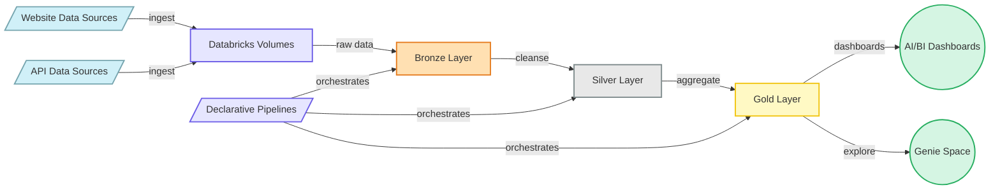
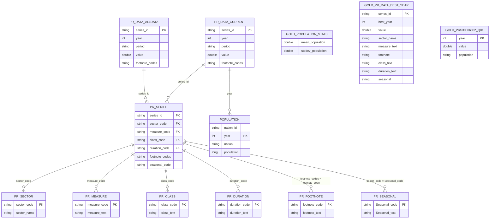

# Process Notes - Rearc Databricks Assignment

## Architecture

- **Bronze/Silver/Gold separation** keeps raw history (Bronze), reusable cleaned/typed assets (Silver), and stakeholder-ready answers (Gold). If a downstream calculation is wrong, I can fix the Gold logic and re-run from Silver without re-landing data.
- **Bronze uses Auto Loader (`cloudFiles`)** so the pipeline is incremental by default. New BLS files or population refreshes are picked up automatically.
- **Values stay STRING in Bronze** because the source is column-delimited text with padded/odd column names. Data typing happens in Silver, where expectations can fail rows cleanly.
- **PySpark is primary in Gold**, with the equivalent Spark SQL kept in comments. This makes the logic testable in a notebook and readable for stakeholders, while still leveraging DataFrame operations for joins, window functions, and aggregations.
- **Ingestion re-runs safely** by comparing the content/size of each fetched file to what is already in the Unity Catalog Volume. Unchanged files are skipped; removed source files are deleted locally so stale data does not stay in Bronze.

## Data Model

The Silver layer is a small star-ish schema: `pr_data_current` (and `pr_data_alldata`) are the fact-like tables, `pr_series` is the central series dimension, and the remaining `pr_*` tables are code-label dimensions. `population` is an independent yearly dimension.

- **Fact tables**: `pr_data_current` and `pr_data_alldata` hold the actual BLS productivity observations. They share the same schema (`series_id`, `year`, `period`, `value`, `footnote_codes`). The assignment questions use `pr_data_current`; `pr_data_alldata` preserves the full historical file if needed later.
- **Series dimension**: `pr_series` is the hub. Each `series_id` maps to codes for sector, measure, class, duration, footnote, and seasonal. These codes are joined to their respective label tables to produce human-readable descriptions in the Gold layer.
- **Code-label dimensions**: `pr_sector`, `pr_measure`, `pr_class`, `pr_duration`, `pr_footnote`, and `pr_seasonal` are small reference tables that translate BLS codes into plain English. They are joined in `pr_data_best_year`.
- **Population dimension**: `population` is independent of the BLS data. It provides `year`, `nation`, and `population` and is joined to `pr_data_current` by `year` in `PRS30006032_Q01_yearly_population`.
- **Gold outputs**: 
  - `population_stats` aggregates `population`.
  - `pr_data_best_year` aggregates `pr_data_current` and joins through `pr_series` to all BLS dimension tables.
  - `PRS30006032_Q01_yearly_population` filters `pr_data_current` and left-joins `population` by `year`.

## Trade-offs (what I would change for a real client)

- **Schema drift**: today Silver tables hard-code column names. A real client would add a schema registry with data contracts and validate incoming data against them.
- **Data volume**: the BLS dataset is small, so a single-node ingestion job is fine. For high-volume sources I would split ingestion into multiple tasks, use Spark to parallelize downloads, and/or land files in cloud storage first.
- **Cost**: this workspace only supports serverless compute, which is easy to operate but can be expensive at scale. I would add job/pipeline schedules, cluster policies, and monitor DBUs per run.
- **Access control**: currently the Gold tables are in the `workspace` catalog. A production setup would use a dedicated catalog, separate schemas per environment, and UC grants scoped to groups (e.g., `rearc_analysts` read-only on Gold).
- **Monitoring**: I would add DLT expectations as metrics, emit job/pipeline failures to a alerting channel (email/Slack/PagerDuty), and build a small observability table tracking run IDs, row counts, and latency.

## Retrospective: hardest part to get right

- **Deploying through Databricks Asset Bundles** took the most iteration. The workspace only allowed serverless compute, so the original classic-cluster job definition had to be switched to a serverless job environment, and the ingestion script had to read its parameters as command-line arguments instead of notebook widgets.
- **Local imports from a standalone Python job** also required a small workaround. Because the job runs from a copied file rather than an installed package, I added the repo `src` folder to `sys.path` at runtime.
- The actual data-modeling questions (best year, population stats, Q01 series) were straightforward once the Bronze/Silver/Gold layers were cleanly separated.
